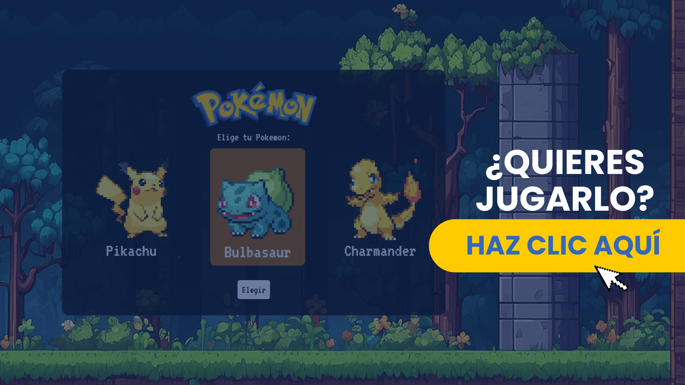

## Pokemones Game

Este proyecto fue realizado con el [Curso de Programación Básica](https://platzi.com/cursos/programacion-basica/) de Platzi, toda la interfaz visual fue iniciativa propia y diseño propio.
Está construido con HTMl, CSS y Javascript vanilla.
 
### ¿Qué aprendí?
- HTML Semántico
- Maquetación en HTML
- Modificar el DOM
- Condicionales If Else
- Funciones y Variables
Este fue mi primer proyecto de código y me permitió adentrarme en la programación, ahora me doy cuenta de lo valioso que es tener bases solidas en HTML y CSS pues solamente con esto ya podemos hacer enormes cambios y mejoras.

### ¿Qué sigue?
Para este proyecto tan bonito y que me trae buen sabor al ser mi primer proyecto tengo unas features pensadas a futuro, a medida que las realice las iré borrando:
- Cada Pokemon tenga sus propios ataques (Agua - Fuego - Tierra pero todos con nombre diferente).
- Agregar nuevos pokemones.
- Mostrar el pokemon enemigo.
- Ajustar errores de vista mobile.

### Un vistazo
> [!TIP]
> Te invito a probarlo y jugar tu mismo [haciendo clic aquí.]().
[Imagen](img/screenshots/1.png)
[Imagen](img/screenshots/2.png)
[Imagen](img/screenshots/3.png)
